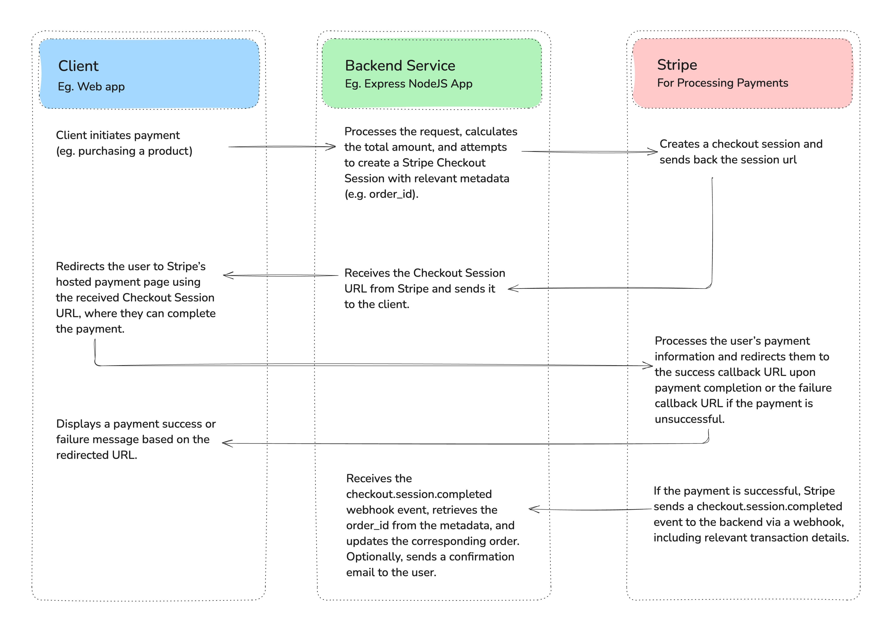

# Accept Payments Seamlessly with Stripe: A Developer's Integration Guide 🚀

This repository contains a step-by-step guide on integrating **Stripe Checkout Sessions** with a **Node.js Express backend**, based on my article:  
[📖 Read the Full Article](https://okraks.medium.com/accept-payments-seamlessly-with-stripe-a-developers-integration-guide-9102c4aaa4be)

## 🛠 Integration Process



## 🛠 Features

- Set up a **Node.js Express** server
- Create a **Stripe Checkout Session**
- Handle **webhooks** for payment confirmation
- Securely process transactions and update orders

## 📌 Prerequisites

- Node.js & npm installed
- A Stripe account ([Sign up here](https://stripe.com))
- Stripe API keys (**Test mode for development**)

## 🚀 Getting Started

### 1️⃣ Clone the Repository & Install packages

```sh
git clone https://github.com/okraks/stripe-integration-guide.git
cd stripe-integration-guide
yarn install
```

### 2️⃣ Set up environment variables

```sh
Duplicate .env.example and replace values with your Test API Keys
```

### 3️⃣ Start the Dev Server

```sh
yarn dev
```

### 📚 Resources

- [Stripe Docs](https://docs.stripe.com)
- [Checkout Sessions Docs](https://docs.stripe.com/api/checkout/sessions)

## 🤝 Contributing

Feel free to open issues and submit PRs!
